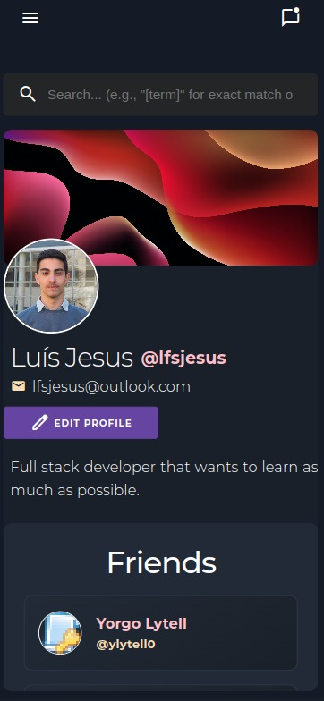

# SkillSwap - Social Network

SkillSwap has been conceived with the primary objective of fostering a thriving community of skill enthusiasts who are passionate about learning and sharing their expertise.


<p align="center">Home Page</p>


<p align="center">Profile Page</p>


<p align="center">Group Page</p>


<p align="center">Chat Page</p>


<p align="center">Notification Page</p>


## Product

The final version was available in `https://lbaw23111.lbaw.fe.up.pt/`.
```code
docker run -it -p 8000:80 --name=lbaw23111 -e DB_DATABASE="lbaw23111" -e DB_SCHEMA="lbaw23111" -e DB_USERNAME="lbaw23111" -e DB_PASSWORD="oeUTuuDs" git.fe.up.pt:5050/lbaw/lbaw2324/lbaw23111
```

### Credentials

- admin@gmail.com / abc (Administrator Account)
- test@gmail.com / abc (Normal User Account)

## Team

* Luís Jesus (up202108683)
* Miguel Rocha (up202108720)
* Miguel Pedrosa (up202108809)

---

GROUP lbaw 23111, 21/12/2023